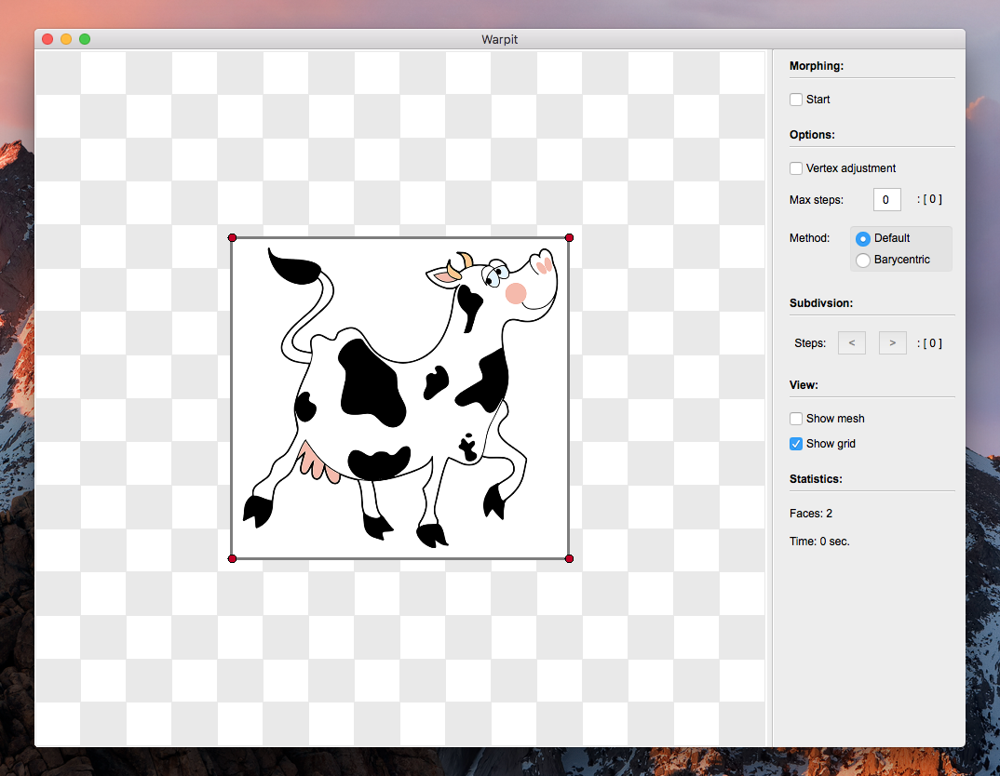
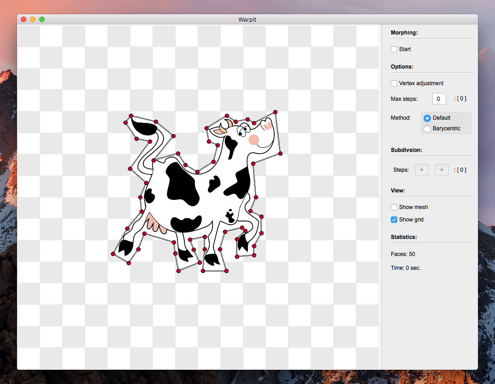
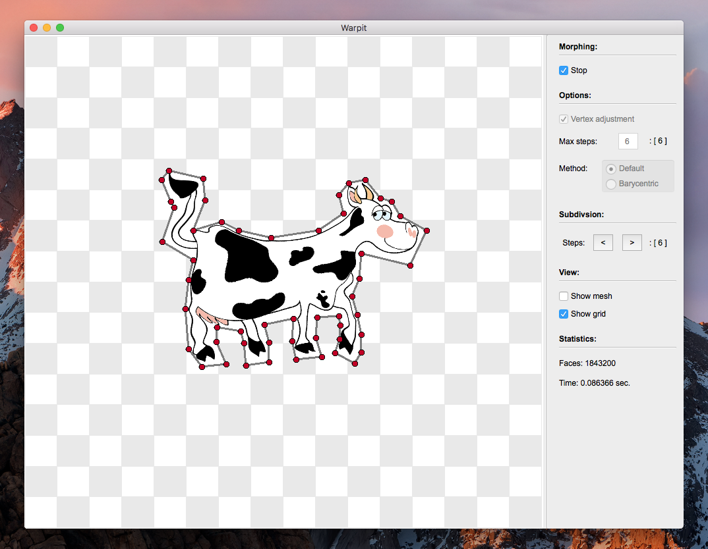
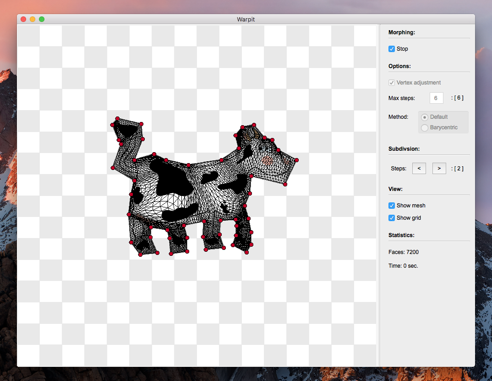

# Image warper (warpit) Ver. 1.0.0

### Description

This program allows you to morph a 2D image as shown in the screenshots section below. The implementation of the warper is based on [subdivision](http://www.multires.caltech.edu/pubs/sig99notes.pdf) of the mesh underlying a polygon around the image and [generalized barycentric coordinates](http://www.inf.usi.ch/hormann/barycentric/index.html). 

##### NOTE: This code/program has been tested only on Mac OS!

### Run the code

In order to run the program do the following:

#### A. Preparation:

##### Mac OS:

1. Install [macports](https://www.macports.org/install.php), then open terminal and type:  
  ```bash
  sudo port install qt5-mac
  ```
  ```bash
  sudo port install qt5-creator-mac
  ```

2. Open warpit.pro and edit the paths to the corresponding folders on the lines 26 and 34-35.

##### Windows:

1. Install Qt 5 and Qt Creator from [here](http://www.qt.io/download-open-source/), when installing choose the version with Open GL.
2. Open warpit.pro and edit the paths to the corresponding folders on the lines 29 and 38-39.

##### NOTE: For Windows uncomment the corresponding lines and comment the Mac OS related lines!

#### B. Compilation:

##### Mac OS:

*First method* (open terminal):  

```bash
cd path_to/warpit/
```
```bash
mkdir bin
```
```bash
cd bin
```
```bash
qmake ..
```
```bash
make -j7
```
```bash
open warpit.app
```

*Second method* (go the project folder):

  a. Configure the file warpit.pro with Qt Creator (just open it and follow the instructions)  
  b. Choose Release vesion in the left bottom corner  
  c. Build and run the program (cmd + R)

##### Windows:

  a. Go to the project folder  
  b. Configure the file warpit.pro with Qt Creator (just open it and follow the instructions)  
  c. Choose Release version in the left bottom corner  
  d. Build and run the program (ctrl + R)

##### NOTE: The program can crash if you choose too many subdivision steps due to the lack of the available memory!

### Screenshots

**_Main screen with the loaded texture_**  


**_Load the source polygon_**  


**_Load the target polygon and morph the image_**  


**_An example with the shown mesh on the target polygon_**  


### Bugs

If you find any bugs, please report them to me, and I will try to fix them as soon as possible!
